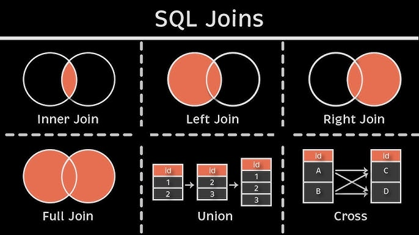
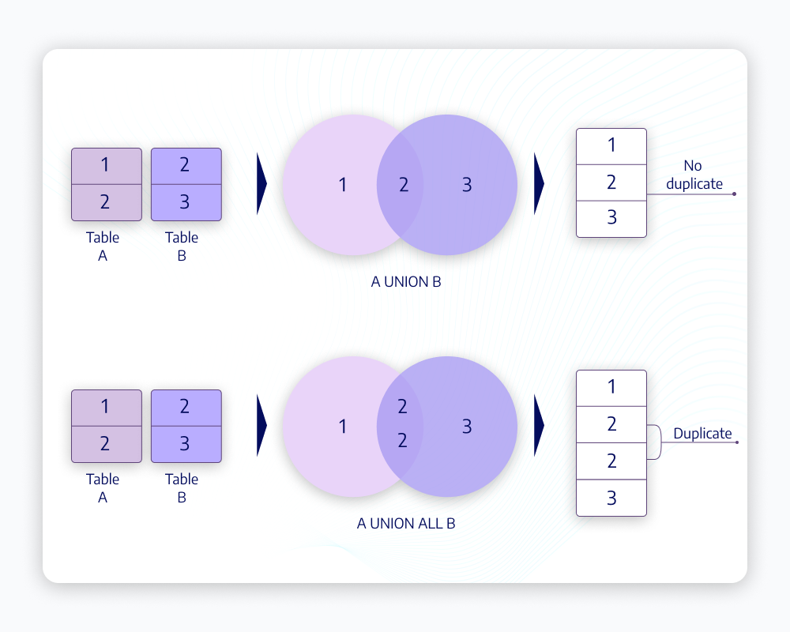

<h1>
  <span class="headline">SQL II Grouping, Filtering, NULLs, and Joins</span>
  <span class="subhead">Intro to SQL Module II</span>
</h1>

This module builds on module SQL-I and covers filtering data, handling NULL values, joining tables, and using common SQL functions. It continues using BigQuery's public `ncaa_basketball` dataset.

To be able to follow along you need to have sucessfully setup your Google Cloud Project, BigQuery Sandbox, and have access to the `ncaa_basketball` dataset. If you haven't done so, please look at the Setup file in SQL-I.

**Data set:** `bigquery-public-data.ncaa_basketball`

**Learning Objectives:**
* Use `GROUP BY` in SQL to group rows of data, and summarize those rows.
* Filter rows using `WHERE` and filter groups using `HAVING`.
* Handle NULL values using `IS NULL` and `IS NOT NULL`.
* Join multiple tables using `INNER JOIN` and `LEFT JOIN`.
* Combine data using `UNION` and `UNION ALL`.
* Use common SQL functions for math calculations and string manipulation.

---

## Contents
- [Part 1: Grouping Data with `GROUP BY`](#part-1-grouping-data-with-group-by)
  - [`GROUP BY`](#group-by)
- [Part 2: Filtering Data with `WHERE`](#part-2-filtering-data-with-where)
- [Part 3: Handling NULL Values](#part-3-handling-null-values)
- [Part 4: Joining Tables](#part-4-joining-tables)
  - [Advanced Joins](#advanced-joins)
- [Part 5: Combining Results with UNION](#part-5-combining-results-with-union)
- [Part 6: Common SQL Functions](#part-6-common-sql-functions)
- [Part 7: Wildcards](#part-7-wildcards)
- [Query Order Reminder](#query-order-reminder)


# Part 1: Grouping Data with `GROUP BY`

## `GROUP BY`

You can use `GROUP BY` to group data by certain columns.
`GROUP BY` is used when you want to:
- Combine rows with the same value
- Calculate aggregate values (like `AVG`) for each group
- Get one row of results per group

When you use `GROUP BY`, you **must** include in your `SELECT` statement the column you want to use to group the data by, and then `GROUP BY` that column.  You should also include in the `SELECT` statement whatever you want to aggregate the data by.

For example, to get the average venue capacity by conference, you would use:

```SQL
-- Average venue capacity by conference
SELECT 
    conf_name AS conference,
    AVG(venue_capacity) AS avg_venue_capacity
FROM bigquery-public-data.ncaa_basketball.mbb_teams
GROUP BY conf_name;
```

You can have more than one aggregate in your query.  So to get the average venue capacity by conference **and** the number of teams in each conference, you would use:

```SQL
-- Average venue capacity and number of teams by conference (ordered by venue capacity)
SELECT
    conf_name AS conference,
    AVG(venue_capacity) AS avg_venue_capacity,
    COUNT (DISTINCT name) AS num_teams
FROM bigquery-public-data.ncaa_basketball.mbb_teams
GROUP BY conf_name
ORDER BY avg_venue_capacity DESC;
```


**Exercise 1.1**
Let's revisit the summary statistics we created for the team when we were learning about `COUNT()`, `SUM()`, and `AVG()`.

1. Calculate the total number of games **for each season** in the `mbb_games_sr` table
```SQL

```

2. Calculate the following statistics **for each season** in the `mbb_games_sr` table:
   - Total number of games
   - Average attendance
   - Sum of all points scored by home teams
```SQL

```

3. Create a query that shows the following statistics **for each conference**:
- Number of teams
- Average venue capacity
- Total venue capacity
- Number of unique venues (some teams might share venues)
- Order the results by the number of teams in descending order.
```SQL

```


You can `GROUP BY` multiple items.  If you want to see the average venue capacity by conference and market, you would use:

```SQL
-- Average venue capacity by conference
SELECT
    conf_name AS conference,
    market,
    AVG(venue_capacity) AS avg_venue_capacity,
    COUNT (DISTINCT name) AS num_teams
FROM bigquery-public-data.ncaa_basketball.mbb_teams
GROUP BY conf_name, market
ORDER BY conference, avg_venue_capacity DESC;
```


# Part 2: Filtering Data with `WHERE`

So far you have learned how to get every row in your table, but what if you only want to get data from certain rows, based on some condition?

The `WHERE` clause filters rows based on conditions:

**Instructor-led demonstration:**
```SQL
-- Get all games with more than 20,000 attendees

SELECT 
    scheduled_date,
    h_name AS home_team,
    a_name AS away_team,
    attendance
FROM bigquery-public-data.ncaa_basketball.mbb_games_sr
WHERE attendance > 20000
ORDER BY attendance DESC;
```

You can combine multiple conditions using `AND`/`OR`:

```SQL
-- Get high-attendance games from a specific season

SELECT 
    scheduled_date,
    h_name AS home_team,
    a_name AS away_team,
    attendance
FROM bigquery-public-data.ncaa_basketball.mbb_games_sr
    WHERE attendance > 20000
    AND season = 2017
ORDER BY attendance DESC;
```

**Exercise 2.1**
Find all the teams with venue capacity under 5,000 from the `mbb_teams` table.
```SQL

```


**Stretch Challenge 2.1**
1. Find all games where the home team scored more than 100 points and won the game from the `mbb_games_sr` table.
```SQL

```

2. Find players who scored more than 200 points in a season. To be able to do this you will have to write a query using a command you haven't learned yet. Hint: you can't use `WHERE` when you are using `GROUP BY`.
```SQL

```

Note: `HAVING` is used to filter groups, `WHERE` is used to filter rows. So you need to use `HAVING` when you are using `GROUP BY`.


# Part 3: Handling NULL Values

NULL represents missing or unknown values. Use IS NULL or IS NOT NULL to filter them:

```SQL
-- Find team mascots without a common name

SELECT name AS team_name, mascot, mascot_common_name
FROM bigquery-public-data.ncaa_basketball.mascots
WHERE mascot_common_name IS NULL;

-- Find team mascots with a common name

SELECT name AS team_name, mascot, mascot_common_name
FROM bigquery-public-data.ncaa_basketball.mascots
WHERE mascot_common_name IS NOT NULL;
```

Sometimes you can filter out NULL values using boolean logic, for example, getting all games where attendance is not null using `> 0`: 

```SQL
-- Get all games where attendance is not null: 
SELECT 
    scheduled_date,
    h_name AS home_team,
    attendance
FROM bigquery-public-data.ncaa_basketball.mbb_games_sr
WHERE attendance > 0;
```

You can also use the `COALESCE` function to replace NULL values with a default value:

```SQL
-- Get all mascot_common_names, but where there is a null value, replace it with the corresponding value from the mascot column
SELECT 
    COALESCE(mascot_common_name, mascot) AS mascot_name
FROM bigquery-public-data.ncaa_basketball.mascots;
```

**Exercise 3.1**
Find all games where attendance data is not missing (IS NOT NULL). **_Stretch: write the query in a different way (using boolean logic)._**
```SQL

```


# Part 4: Joining Tables

You have learned how to get data from a single table, but what if you need to get data from multiple tables in your database? Joins allow you to combine rows from multiple tables based on related columns. 

Before diving into joins, let's look at the different types of joins visually:

<p align="center">
  
</p>


Now let's look at how to use these joins with our NCAA basketball data:


```SQL
-- Get the mascots for each team (joining the mascots table to the teams table)

SELECT 
    t.name AS team_name,
    m.mascot_name,
FROM bigquery-public-data.ncaa_basketball.mbb_teams AS t
INNER JOIN bigquery-public-data.ncaa_basketball.mascots AS m
    ON t.id = m.id;
```

Note: 

1. In the above query, you used AS to rename the tables (as well as one of the columns), making it easier for us to reference (saves of from having to write the whole path).
2. The default JOIN type BigQuery (and most SQL flavors) is an INNER JOIN, so this query yields the same results as the one above: 

```SQL
SELECT 
    t.name AS team_name,
    m.mascot_name,
FROM bigquery-public-data.ncaa_basketball.mbb_teams t
JOIN bigquery-public-data.ncaa_basketball.mascots m --note INNER part is removed
    ON t.id = m.id;
```

**Exercise 4.1**
Get the colors for each team.
```SQL

```

## Advanced Joins

You can also join multiple tables and use different types of joins:

```SQL
-- Get the team name, mascot, and primary color for each team

SELECT 
    t.name AS team_name,
    m.mascot_name,
    c.color AS primary_color
FROM bigquery-public-data.ncaa_basketball.mbb_teams t
INNER JOIN bigquery-public-data.ncaa_basketball.mascots m
    ON t.id = m.id
INNER JOIN bigquery-public-data.ncaa_basketball.team_colors c
    ON t.id = c.id;
```

```SQL
-- Get all teams and their games (if any) using a LEFT JOIN

SELECT 
    t.name AS team_name,
    g.scheduled_date,
    g.attendance
FROM bigquery-public-data.ncaa_basketball.mbb_teams t
LEFT JOIN bigquery-public-data.ncaa_basketball.mbb_games_sr g
    ON t.id = g.h_id;
```


**Exercise 4.2**
The marketing team wants to know when each mascot has made an appearance in a game. Could you help them by providing a list of all teams, their mascots, and date of their games? 

_Hint: some teams don't have a mascot name, so you will have to filter them out._

```SQL

```


**Stretch Challenge 4.2**
Write a query that:
1. Gets each team's name and mascot
2. Finds their most recent game date (whether they were home or away team)
3. Orders results from newest to oldest games
4. Excludes any teams that don't have a mascot name in the mascots table
```SQL

```


# Part 5: Combining Results with UNION

**Note:**

`UNION` combines results from multiple SELECT statements into a single result set. For `UNION` to work:

1. Both queries must have the same number of columns
2. Corresponding columns must have compatible data types
3. Column names from the first query will be used in the result

Note you can also use `UNION ALL`, here are the differences:

- `UNION` removes duplicate rows from the combined result
- `UNION ALL` keeps all rows, including duplicates
- `UNION ALL` is faster since it doesn't need to check for duplicates

Visual representation of `UNION` vs `UNION ALL`:

<p align="center">
  
</p>

Let's see what this looks like in a SQL query:

```SQL
-- Get all team names and mascot names in one list

SELECT name AS entity_name, 'team' AS type
FROM bigquery-public-data.ncaa_basketball.mbb_teams
UNION ALL
SELECT mascot_name, 'mascot'
FROM bigquery-public-data.ncaa_basketball.mascots;
```


**Note:** You have just learned about the most common types of joins, if you are curious, you can read more about another one: [Cross Join](https://www.w3schools.com/mysql/mysql_join_cross.asp)


# Part 6: Common SQL Functions

SQL provides many built-in functions. Below you will learn about some common ones.

For a full list of functions, you can follow this link: https://cloud.google.com/bigquery/docs/reference/standard-sql/functions-and-operators


Now, lets start with a function that makes it easier for you to work with dates:

```SQL
-- Date functions
SELECT 
    scheduled_date,
    EXTRACT(YEAR FROM scheduled_date) AS year,
    EXTRACT(MONTH FROM scheduled_date) AS month
FROM bigquery-public-data.ncaa_basketball.mbb_games_sr
LIMIT 5;
```


Next, lets learn about some math functions:

```SQL
-- Math functions
SELECT 
    h_points,
    a_points,
    ABS(h_points - a_points) AS point_difference,
    ROUND(h_points * 1.1, 0) AS points_with_bonus
FROM bigquery-public-data.ncaa_basketball.mbb_games_sr
LIMIT 5;
```

Next, lets learn about some string functions:

```SQL
-- String functions
SELECT 
    UPPER(name) AS upper_name,
    LOWER(market) AS lower_market,
    LENGTH(name) AS name_length
FROM bigquery-public-data.ncaa_basketball.mbb_teams
LIMIT 5;
```

**Exercise 6.1**
What is the maximum attendance for each season?
```SQL

```

**Stretch challenge 6.1**
Calculate the average point difference between home and away teams for each season.
```SQL

```


You can also use `LIKE` to filter strings. For example, get all team player names that names have the word "Smith" in them.


# Part 7: Wildcards

What is a wildcard?

Imagine you're searching a big library:

Think of your database as a giant library, and each table within it is like a shelf of books. Each column in your table is like a specific piece of information written on each book.

Now, let's say you want to find books with "magic" in the title. You don't know if it's "The Magic Treehouse," "A Wizard's Magic," or "The Magic of Unicorns." You don't want to search for each of those separately.

Wildcards to the Rescue!

In SQL, **wildcards** are like special symbols you can use in your search to find a broader range of results, just like using a less specific term when searching in the library.

We can use `LIKE` and wildcards (%) to broaden our string filters:

```SQL
-- Get a list of players' first and last names where their first name starts with the letter "R"
SELECT first_name, last_name
FROM bigquery-public-data.ncaa_basketball.mbb_players_games_sr
WHERE first_name LIKE 'R%';
```

```SQL
-- Get a list of players' first and last names where their last name ends with the letter "r"
SELECT first_name, last_name
FROM bigquery-public-data.ncaa_basketball.mbb_players_games_sr
WHERE last_name LIKE '%r';
```

```SQL
-- Get a list of players' first and last names where their last name contains the letter "r"
SELECT first_name, last_name
FROM bigquery-public-data.ncaa_basketball.mbb_players_games_sr
WHERE last_name LIKE '%r%';
```

Notes:

- `ILIKE` is a case insensitive `LIKE`. (Note: available in PostgreSQL, not in others)
- You can negate a `LIKE` with `NOT LIKE`.


**Exercise 7.1**
- Find all the mascot names that start with the letter `P`.
```SQL

```

**Stretch exercise 7.1**
- Find the first and last names of all players with a last name that contains the word "Smith".
```SQL

```

# Query Order Reminder

Your SQL clauses have to be in a specific order, otherwise you'll throw an exception.

1. `SELECT` - What columns do you want?
2. `FROM` - Which table?
   - `JOIN` or `UNION`
3. `WHERE` - What conditions must be met? 
4. `GROUP BY` - What groups do you want to see?
5. `HAVING` - What conditions must be met for groups? 
6. `ORDER BY` - How do you want to order the results?
7. `LIMIT` - How many rows do you want to return?

Mnemonic: "Smelly Feet Will Give Horrible Odors, Lingeringly"